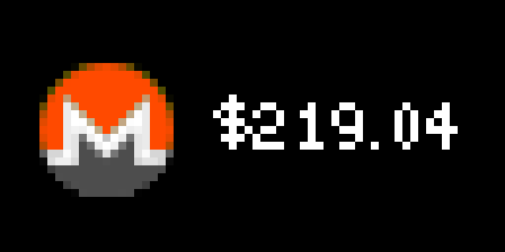
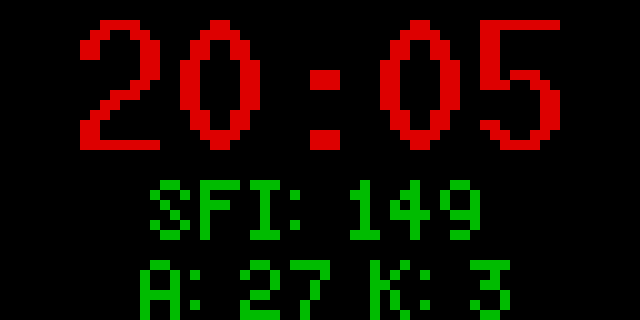

# tidbyt-apps

My [Tidbyt](https://tidbyt.com/) apps. These are apps that are run to update my [Tidbyt](https://github.com/tidbyt/pixlet) device. The makers of the device host a github repo, Pixlet, which is an app that leverages [GO](https://go.dev/) and [Starlark](https://github.com/bazelbuild/starlark) languages to create and push webp images to the device. It's an IOT device that provides a 64x32 color pixel display.

## Monero

Updates the device with the current Monero value.

## Hamclock

Displays the current UTC Time, Solar Flux, A and K indices.

